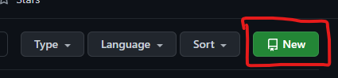

# Luis Alfonso Martin Velázquez

[Practica-1](./Practica-1.md)

[Practica-2](./Practica-2.md)

[Practica-4](https://github.com/Wicho115/Sistemas-Op-Practica4)

[Practica 1 - Parcial 2](https://github.com/Wicho115/Parcial2-Practica1)

Haciendo cambios y prbando la opción amend

Creando la version _1.0.0_ de nuestro repositorio

<br>

# ¿Cómo se inicializa un repositorio?

## se inicializa con el siguiente comando:

```bash
git init
```

<br>

# ¿Cómo creas un repositorio?
## Se crea desde tu usario de [github](https://github.com/) con el siguiente boton:



<br>

# ¿Cómo vinculas un respositorio local de Git con uno remoto en Github?

## se vincula mediante el url que github te da cuando creas el repositorio remoto, con este comndo: 

```bash
git rmeote add origin https://github.com/(usuario)/(repositorio).git
```

<br>

# ¿Cuál es el flujo básico de trabajo de github?

## se usan estos 3 comando como el flujo basico

```bash
git add .
git commit -m "Commit"
git push
```

